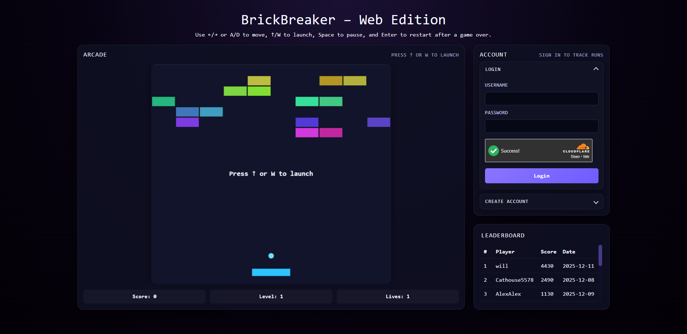

> Continuation of the original group project. Frozen version: [BrickBreaker-Group](https://github.com/lanavirsen/BrickBreaker-Group)

# BrickBreaker – Extended Edition

  [](https://codecov.io/gh/lanavirsen/BrickBreaker-Extended)

Play it live: https://brickbreaker-extended.netlify.app

BrickBreaker is a Blazor WebAssembly remake of the classic paddle-and-bricks arcade game, deployed as a responsive web app that streams the .NET gameplay loop into a `<canvas>`. The browser client handles login, registration, CAPTCHA, score submission, and leaderboard views while sharing the same `GameEngine` used by the desktop builds. Console and WinForms shells remain in the repo to demonstrate how multiple UI layers can plug into the shared gameplay/session architecture without forking core logic.

## Gameplay screenshot

<p align="center">
  
</p>

## Highlights

- **Web-first experience** – `BrickBreaker.WebClient` is a Blazor WebAssembly front-end that centers the canvas inside a responsive two-column layout, keeps the leaderboard/account panels aligned, and shows warm-up placeholders while the API wakes up.
- **Shared gameplay loop** – `BrickBreaker.Gameplay` wraps the `GameEngine` in a reusable session + render-state model so every client (web, WinForms, Spectre.Console) plays the same game with identical physics/power-ups.
- **WinForms renderer @ 60 FPS** – `BrickBreaker.WinFormsClient` still ships with a borderless, high-frame-rate renderer and launcher UI to demonstrate a desktop host reusing the shared game session.
- **Spectre.Console shell** – `BrickBreaker.ConsoleClient` highlights a terminal-first UX for auth, Quick Play, and leaderboard browsing without needing a graphical surface.
- **Supabase/PostgreSQL persistence** – When a connection string is available, credentials are hashed, scores are stored through `BrickBreaker.Storage`, and all clients can submit/query the same leaderboard. Disabled stores keep gameplay working offline.
- **Automated tests** – `BrickBreaker.Tests` exercises authentication, password hashing, profanity filtering, and leaderboard ordering so domain logic stays correct regardless of the UI host.

## Project layout

```
BrickBreaker/
├── BrickBreaker.sln             Solution root (net9.0)
├── BrickBreaker.Game/           Pure gameplay engine - physics, ball/paddle/brick logic, entities
├── BrickBreaker.Gameplay/       Shared GameSession + render models (used by all clients)
├── BrickBreaker.Core/           Domain models + services (Auth, Leaderboard, abstractions)
├── BrickBreaker.Storage/        Supabase/PostgreSQL stores + configuration helpers
│   ├── StorageConfiguration.cs  Resolves Supabase connection strings
│   ├── UserStore.cs             Npgsql-backed implementation
│   ├── LeaderboardStore.cs      Npgsql-backed implementation
│   └── Disabled*.cs             Null-object stores for offline play
├── BrickBreaker.Api/            ASP.NET Minimal API - auth, leaderboard, CAPTCHA endpoints
├── BrickBreaker.ConsoleClient/  Spectre.Console client with terminal renderer + Supabase auth
├── BrickBreaker.WinFormsClient/ WinForms client (launcher + Form1 gameplay)
│   ├── Hosting/                 IGame implementation for desktop play
│   └── WinUI/                   WinForms forms, drawing, input, assets
├── BrickBreaker.WebClient/      Blazor WebAssembly canvas client for browsers
├── BrickBreaker.Tests/          xUnit tests for Auth + Leaderboard logic
└── README.md
```

## Run the game locally

Prerequisites: .NET 9 SDK and (optionally) access to the Supabase/PostgreSQL instance referenced below.

### For full functionality (auth + leaderboard)

1. **Configure the API:**
   ```bash
   # Copy the template and configure JWT secret + Supabase connection string
   cp BrickBreaker.Api/appsettings.Template.json BrickBreaker.Api/appsettings.json
   ```

2. **Run the API and WebClient:**
   ```bash
   # Terminal 1: Run the API backend
   dotnet run --project BrickBreaker.Api

   # Terminal 2: Run the Blazor WebAssembly client
   dotnet run --project BrickBreaker.WebClient
   ```

### For offline/guest play

```bash
# Just run the WebClient (auth/leaderboard features disabled)
dotnet run --project BrickBreaker.WebClient

# Or try the desktop clients
dotnet run --project BrickBreaker.WinFormsClient
dotnet run --project BrickBreaker.ConsoleClient
```

### Build and test

```bash
dotnet restore
dotnet build BrickBreaker.sln
dotnet test BrickBreaker.sln
```

## Tests

Run `dotnet test BrickBreaker.sln` to execute the xUnit suite. Tests rely on the storage abstractions, so they run without real database access.

## Deployment

- `.github/workflows/ci.yml` restores, builds, runs the tests, and pushes the API container to GHCR before updating the Azure Container Apps revision.
- `.github/workflows/frontend-deploy.yml` publishes `BrickBreaker.WebClient` and deploys the static site to Netlify.
