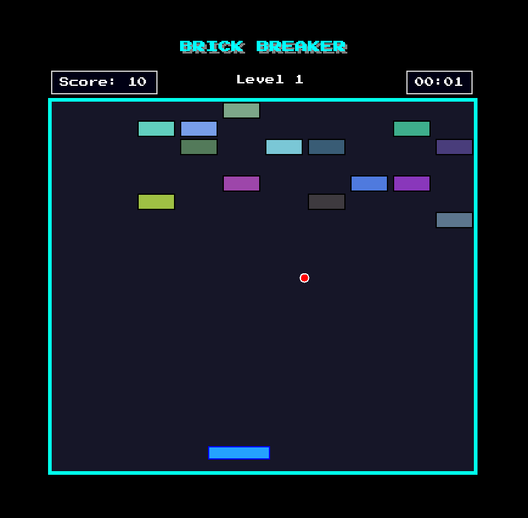

> Continuation of the original group project. Frozen version: [BrickBreaker-Group](https://github.com/lanavirsen/BrickBreaker-Extended)

# BrickBreaker – Extended Edition

  [](https://codecov.io/gh/lanavirsen/BrickBreaker-Extended)

BrickBreaker is a .NET 9 WinForms remake of the classic paddle-and-bricks arcade game.  
The gameplay runs inside a desktop window, while Spectre.Console menus handle login, Quick Play, and leaderboard actions. Every frame, power-up, and collision is authored directly in code.

## Gameplay screenshot

<p align="center">
  
</p>

## Highlights

- **WinForms renderer @ 60 FPS** – `Form1` maximizes to a borderless window, locks the frame rate with a Windows Forms timer, and uses custom fonts, rainbow borders, and score pop-ups.
- **WinForms client shell** – `BrickBreaker.WinFormsClient` layers a login/register menu, Quick Play toggle, and leaderboard viewer on top of the renderer while talking to the ASP.NET API for auth + score submission.
- **Engine features** – `GameEngine` drives multi-ball, paddle-extender power-ups, brick layouts, score multipliers, and ball tethering before launch so runs stay fair on a keyboard.
- **Spectre.Console shell** – `BrickBreaker.UI` offers registration, login, best-score lookup, leaderboard browsing, Quick Play, and exit flows using a small state machine.
- **Blazor web client** – `BrickBreaker.WebClient` reuses the `GameEngine` inside a `<canvas>` via WebAssembly so the browser build stays feature-complete with the desktop renderer.
- **Supabase/PostgreSQL persistence** – When a connection string is available, credentials are hashed, scores are written through `BrickBreaker.Storage`, and the UI surfaces per-user best scores plus a Top-10 leaderboard. When offline, disabled stores keep the game playable and the console warns that persistence is unavailable.
- **Automated tests** – `BrickBreaker.Tests` uses xUnit to validate authentication, password hashing, and leaderboard ordering via the shared abstractions so logic stays correct regardless of the backing store.

## Project layout

```
BrickBreaker/
├── BrickBreaker.sln             Solution root (net9.0)
├── BrickBreaker.WinFormsClient/ WinForms client (launcher + Form1 gameplay)
│   ├── Hosting/                 IGame implementation for desktop play
│   └── WinUI/                   WinForms forms, drawing, input, assets
├── BrickBreaker.WebClient/      Blazor WebAssembly canvas client for browsers
├── BrickBreaker.Core/           Domain models + services (Auth, Leaderboard, abstractions)
├── BrickBreaker.Storage/        Supabase/PostgreSQL stores + configuration helpers
│   ├── StorageConfiguration.cs  Resolves Supabase connection strings
│   ├── UserStore.cs             Npgsql-backed implementation
│   ├── LeaderboardStore.cs      Npgsql-backed implementation
│   └── Disabled*.cs             Null-object stores for offline play
├── BrickBreaker.UI/             Spectre.Console menus (login → gameplay shell)
├── BrickBreaker.Tests/          xUnit tests for Auth + Leaderboard logic
└── README.md
```

## Run the game locally

Prerequisites: .NET 9 SDK and (optionally) access to the Supabase/PostgreSQL instance referenced below.

```bash
# Restore all projects
dotnet restore

# Launch the WinForms client (API-backed login + gameplay)
dotnet run --project BrickBreaker.WinFormsClient

# Launch the Blazor WebAssembly client (canvas renderer)
dotnet run --project BrickBreaker.WebClient

# Run the Spectre.Console shell + WinForms gameplay loop (login, Quick Play, leaderboard)
dotnet run --project BrickBreaker.UI

# Optional: build every project or run the unit tests
dotnet build BrickBreaker.sln
dotnet test BrickBreaker.sln
```

The WinForms client reads the backend URL from the `BRICKBREAKER_API_URL` environment variable (defaults to `http://localhost:5080`) and can also be changed at runtime inside the launcher UI.

### Configure Supabase/PostgreSQL

The Spectre.Console UI checks for a connection string at startup:

1. Update `BrickBreaker.Storage/Properties/appsettings.json` **or** set an environment variable named `Supabase` / `ConnectionString:Supabase`.
2. Provide a standard Npgsql connection string, for example:

```json
{
  "ConnectionString": {
    "Supabase": "Host=...;Port=5432;Database=...;Username=...;Password=...;Ssl Mode=Require;Trust Server Certificate=true"
  }
}
```

When present, registration/login, leaderboard submissions, per-user best scores, and the Top-10 table use the hosted database. When absent, the UI clearly warns that those features are disabled but gameplay/Quick Play still works via the disabled stores.

### Controls & tips

- `←` / `→` or `A` / `D` move the paddle, `↑` / `W` launches the tethered ball, `P` pauses the WinForms loop, `F` toggles borderless fullscreen, `Esc` exits, and `Space` restarts after game over.
- Quick Play skips authentication and does not attempt to submit scores.
- Logged-in players can open the gameplay menu after each run to view their best score or browse the Top-10 Spectre console table.

## Tests

Run `dotnet test BrickBreaker.sln` to execute the xUnit suite. Tests rely on the storage abstractions, so they run without real database access.
