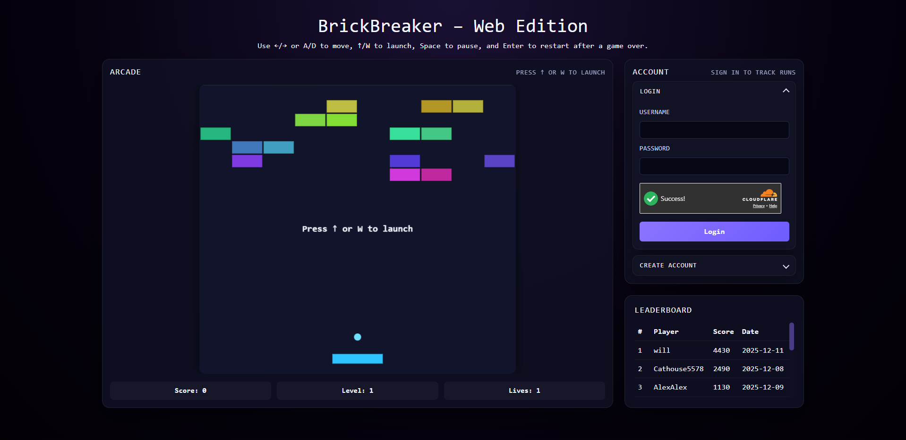
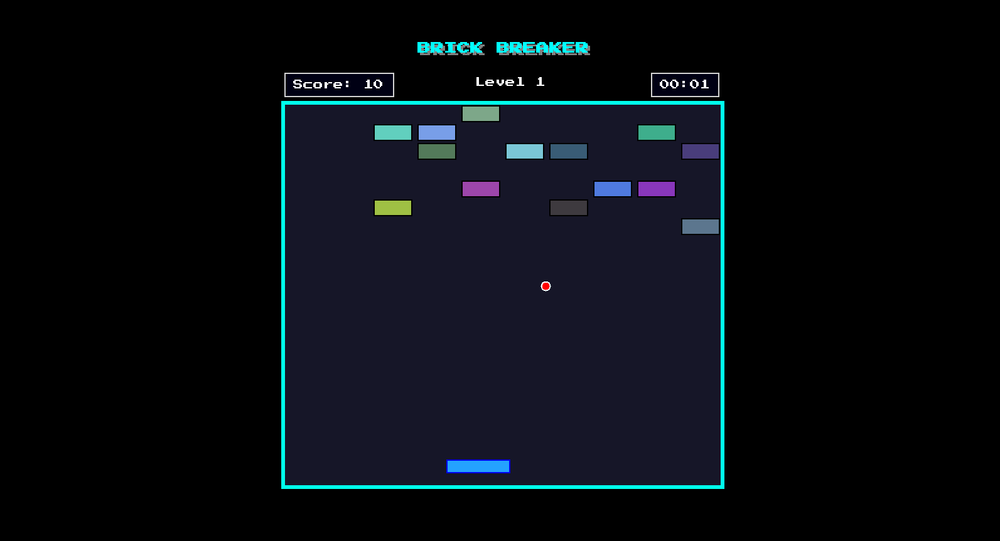
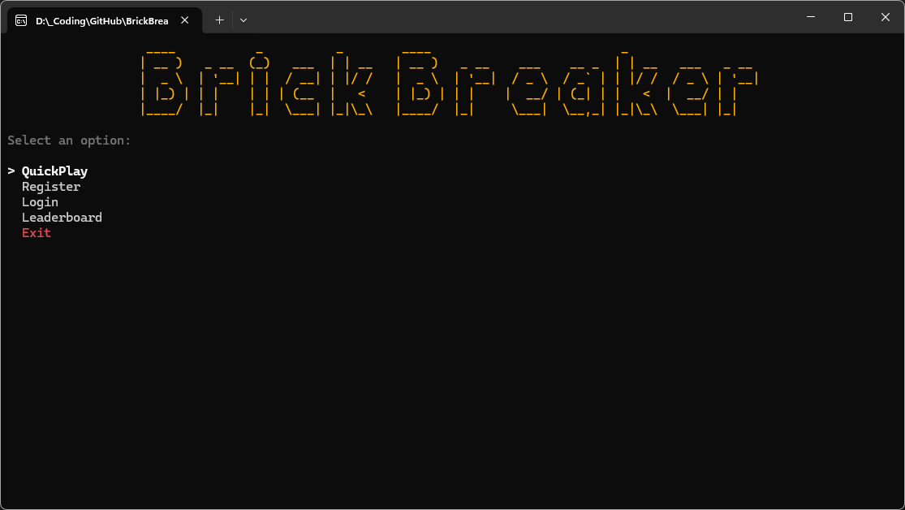
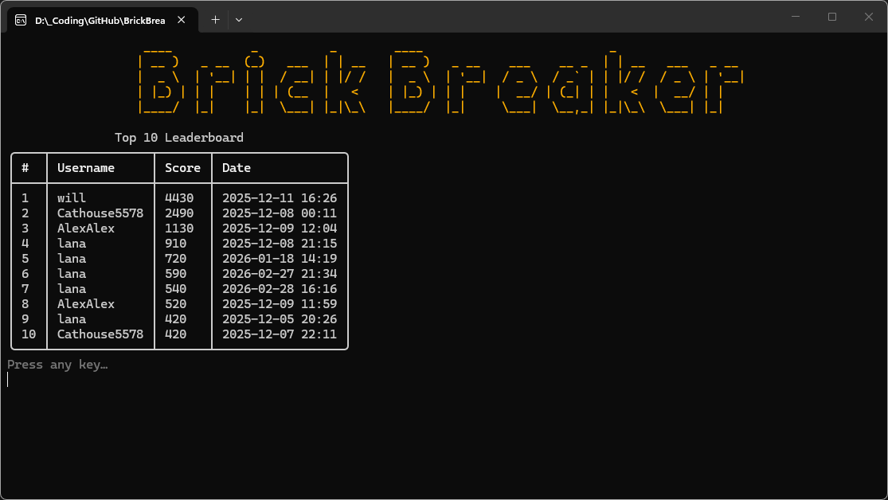
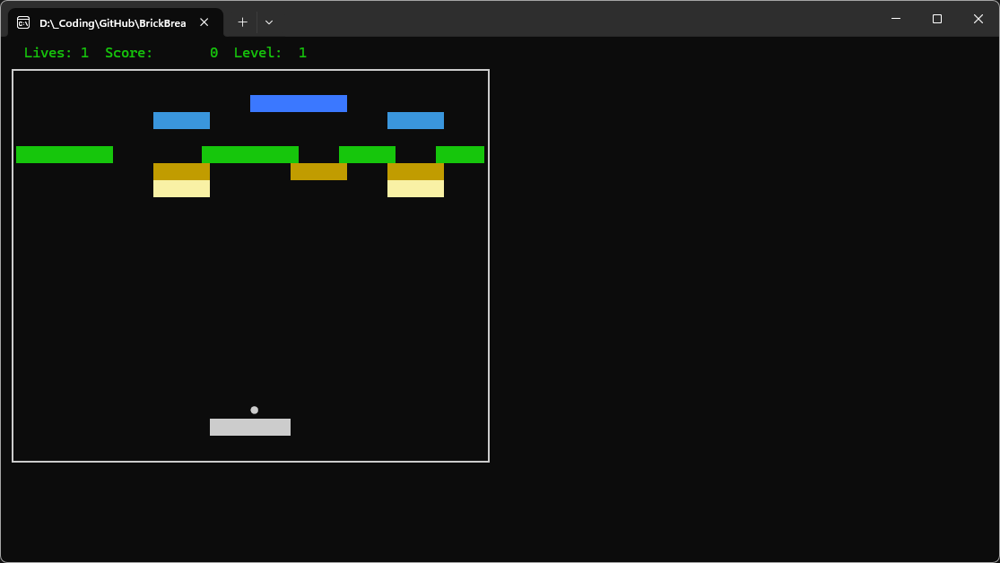

> Continuation of the original group project. Frozen version: [BrickBreaker-Group](https://github.com/lanavirsen/BrickBreaker-Group)

# BrickBreaker - Extended Edition

  [](https://codecov.io/gh/lanavirsen/BrickBreaker-Extended)

Play it live: https://brickbreaker-extended.netlify.app

BrickBreaker - Extended Edition is a multi-client paddle-and-bricks arcade game built on a shared .NET gameplay engine. Three independent front-ends - a Blazor WebAssembly web app, a WinForms desktop client, and a Spectre.Console terminal client - all drive the same `GameEngine` through a common `GameSession` abstraction, keeping physics, level progression, and scoring identical across every platform. All three clients support login, score submission, and leaderboard browsing; the web client additionally integrates CAPTCHA verification.

## Gameplay

- **5 levels** with increasing brick density. Beyond level 5 the layout repeats while the level counter and ball speed keep climbing.
- **Scoring** - each brick scores points multiplied by the current streak. The streak grows with every consecutive brick hit and resets when the ball touches the paddle.
- **Ball speed** rises each level, so the game gets faster.
- **Power-ups** drop from destroyed bricks and fall until caught by the paddle or lost off-screen:
  - **Multiball (M)** - splits into three balls.
  - **Paddle Extender (E)** - widens the paddle for 10 seconds; the paddle blinks as a warning before it shrinks back.
- **Game over** when the last ball falls below the paddle.

## Screenshots

### Web client

<p align="center">
  
</p>

### WinForms client

<p align="center">
  
</p>

### Console client

<p align="center">
  
  
</p>
<p align="center">
  
</p>

## Highlights

- **Responsive web client** - `BrickBreaker.WebClient` is a Blazor WebAssembly front-end that centers the canvas inside a responsive two-column layout and shows loading placeholders while the API wakes from a cold start.
- **Shared gameplay loop** - `BrickBreaker.Gameplay` wraps the `GameEngine` in a reusable `GameSession` + `GameRenderState` model so all three clients (web, WinForms, console) share identical physics, level progression, power-up logic, and scoring without any duplicated game code.
- **WinForms renderer @ 60 FPS** - `BrickBreaker.WinFormsClient` provides a borderless, high-frame-rate GDI+ renderer and launcher UI, demonstrating a native desktop host built on the shared game session.
- **Spectre.Console shell** - `BrickBreaker.ConsoleClient` renders the full game in a 62×24 character grid driven by the shared engine, alongside a Spectre.Console menu shell for auth, Quick Play, and leaderboard browsing.
- **Supabase/PostgreSQL persistence** - When a connection string is available, credentials are hashed, scores are stored through `BrickBreaker.Storage`, and all clients can submit/query the same leaderboard. Disabled stores keep gameplay working offline.
- **Automated tests** - `BrickBreaker.Tests` covers auth, leaderboard, game session behaviour, and shell logic so core functionality stays correct across all clients.

## Project layout

```
BrickBreaker/
├── BrickBreaker.sln             Solution root (net9.0)
├── BrickBreaker.Game/           Pure gameplay engine - physics, ball/paddle/brick logic, entities
├── BrickBreaker.Gameplay/       Shared GameSession + render models (used by all clients)
├── BrickBreaker.Core/           Domain models + services (Auth, Leaderboard, abstractions)
├── BrickBreaker.Storage/        Supabase/PostgreSQL stores + Null-object offline fallbacks
├── BrickBreaker.Api/            ASP.NET Minimal API - auth, leaderboard, CAPTCHA endpoints
├── BrickBreaker.ConsoleClient/  Spectre.Console client with terminal renderer + Supabase auth
├── BrickBreaker.WinFormsClient/ WinForms client (launcher + Form1 gameplay)
├── BrickBreaker.WebClient/      Blazor WebAssembly canvas client for browsers
├── BrickBreaker.Tests/          xUnit tests for auth, leaderboard, game session, and shell logic
└── README.md
```

## Run the game locally

Prerequisites: .NET 9 SDK.

```bash
dotnet run --project BrickBreaker.WebClient
dotnet run --project BrickBreaker.WinFormsClient
dotnet run --project BrickBreaker.ConsoleClient
```

Auth and leaderboard require a reachable API. To run one locally:

### Local API setup

To run against a local API instead:

1. **Configure the API:**
   ```bash
   # Copy the template and fill in JWT secret + Supabase connection string
   cp BrickBreaker.Api/appsettings.Template.json BrickBreaker.Api/appsettings.json
   ```

2. **Start the API:**
   ```bash
   dotnet run --project BrickBreaker.Api
   ```

3. **Point a client at it:**
   - **WebClient** - update `ApiBaseUrl` in `BrickBreaker.WebClient/wwwroot/appsettings.json`
   - **ConsoleClient** - pass the URL as a CLI argument: `dotnet run --project BrickBreaker.ConsoleClient https://localhost:5001/`
   - **WinFormsClient** - use the in-app Settings dialog to change the API URL

### Build

```bash
dotnet restore
dotnet build BrickBreaker.sln
```

## Tests

Run `dotnet test BrickBreaker.sln` to execute the xUnit suite. Tests rely on the storage abstractions, so they run without real database access.

## Deployment

- `.github/workflows/ci.yml` restores, builds, runs the tests, and pushes the API container to GHCR before updating the Azure Container Apps revision.
- `.github/workflows/frontend-deploy.yml` publishes `BrickBreaker.WebClient` and deploys the static site to Netlify.
